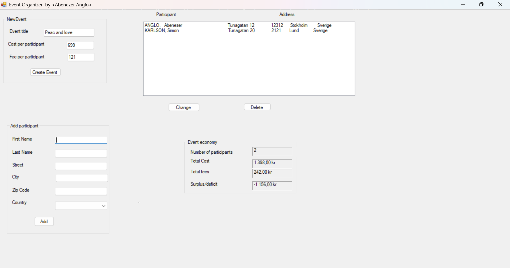

# Event Organizer

A Windows Forms desktop application built with C# and .NET Framework for managing events and participants with financial tracking capabilities.

## Features

- **Event Management** - Create events with custom titles, cost per participant, and fee per participant
- **Participant Management** - Add, edit, and delete participants with full address details
- **Financial Tracking** - Automatically calculate total costs, total fees, and surplus/deficit
- **International Support** - Country selection from a comprehensive list of world countries
- **Real-time Updates** - GUI updates dynamically as participants are added or modified

## Tech Stack

- **Framework:** .NET Framework 4.7.2
- **Language:** C#
- **UI:** Windows Forms (WinForms)
- **IDE:** Visual Studio

## Project Structure

```
EventOrganizer/
├── Program.cs              # Application entry point
├── MainForm.cs             # Main Windows Form UI and logic
├── MainForm.Designer.cs    # Auto-generated form designer code
├── MainForm.resx           # Form resources
├── EventManager.cs         # Event business logic and calculations
├── ParticipantManager.cs   # Participant collection management
├── Participant.cs          # Participant data model
├── Address.cs              # Address data model
├── Countries.cs            # Enum of world countries
├── EventOrganizer.sln      # Visual Studio solution file
├── EventOrganizer.csproj   # Project configuration
├── App.config              # Application configuration
└── Properties/
    ├── AssemblyInfo.cs     # Assembly metadata
    ├── Resources.resx      # Application resources
    └── Settings.settings   # Application settings
```

## Class Overview

| Class | Description |
|-------|-------------|
| `MainForm` | Main application window handling user interactions and GUI updates |
| `EventManager` | Manages event details (title, costs, fees) and financial calculations |
| `ParticipantManager` | Handles participant collection operations (add, edit, delete, retrieve) |
| `Participant` | Represents a participant with first name, last name, and address |
| `Address` | Stores address information (street, city, zip code, country) |
| `Countries` | Enumeration of world countries for address selection |

## Installation

1. **Clone the repository:**
   ```bash
   git clone https://github.com/AbaSheger/Eventorganizer.git
   ```

2. **Open in Visual Studio:**
   - Open `EventOrganizer.sln` in Visual Studio 2019 or later

3. **Build the solution:**
   - Press `Ctrl + Shift + B` or go to Build → Build Solution

4. **Run the application:**
   - Press `F5` or click the Start button

## Usage

1. **Create an Event:**
   - Enter the event title
   - Set the cost per participant
   - Set the fee per participant

2. **Add Participants:**
   - Fill in participant details (first name, last name)
   - Enter address information (street, city, zip code)
   - Select country from the dropdown
   - Click Add to register the participant

3. **Manage Participants:**
   - Select a participant from the list to edit or delete
   - Changes are reflected in real-time

4. **Track Finances:**
   - View total costs, fees, and surplus/deficit in the event economy section
   - Values update automatically as participants are added or removed

## Screenshot



## Contributing

Contributions are welcome! To contribute:

1. Fork the repository
2. Create a feature branch (`git checkout -b feature/your-feature`)
3. Commit your changes (`git commit -m 'Add your feature'`)
4. Push to the branch (`git push origin feature/your-feature`)
5. Open a Pull Request

## License

This project is licensed under the MIT License.
